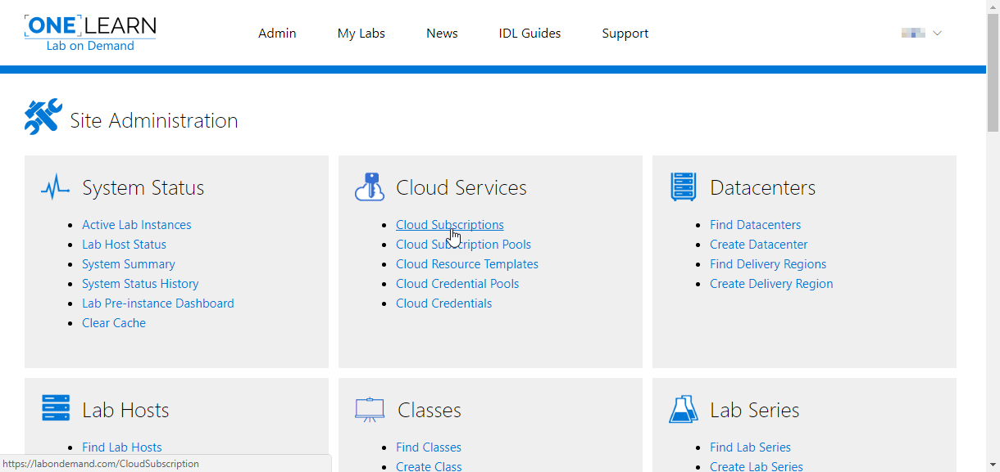
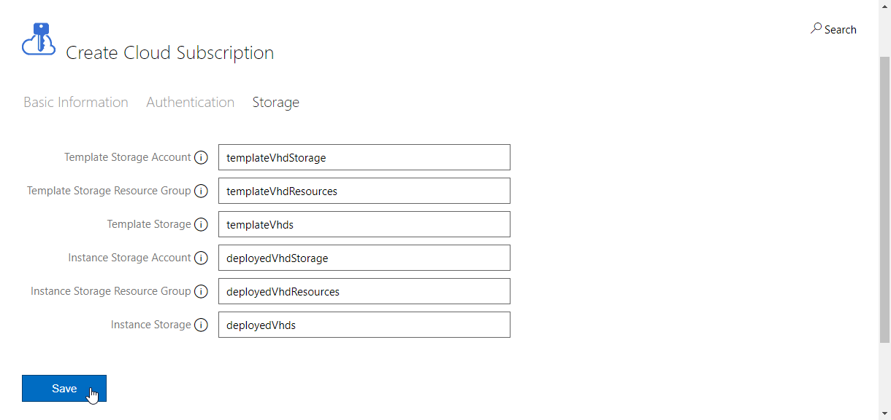
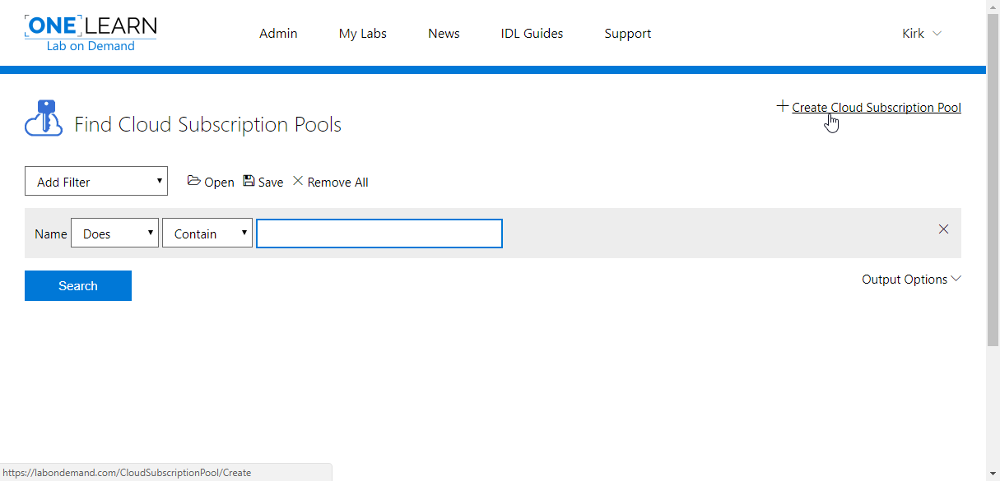
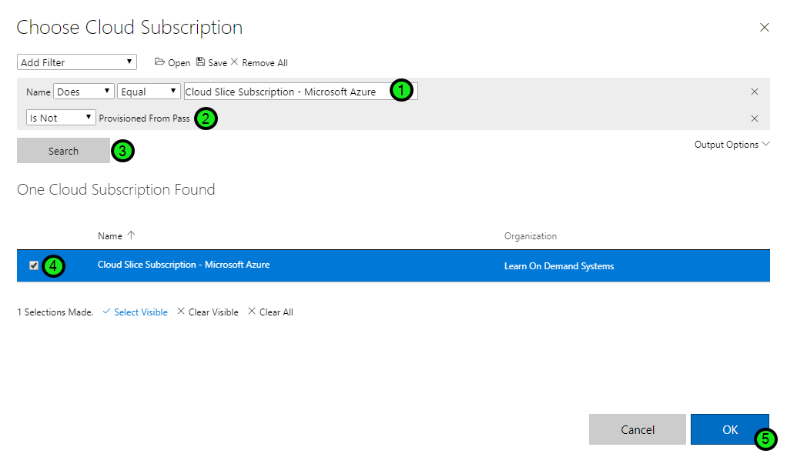

# Cloud Slice Guide

This guide will walk you through how to create a lab that provisions dynamically created cloud subscriptions, each of which may also contain one or more cloud resources (virtual machines, networks, databases, websites, etc.), to each student using that lab. Each student will have access to the cloud subscription that is provided to them, along with the resources contained within that subscription, for the duration of the lab. The combination of one of these subscriptions with the resources contained within it is collectively referred to as a Cloud Slice.

There are two ways that cloud resources are made available within a Cloud Slice: as managed cloud resources and as unmanaged cloud resources.

Managed cloud resources are cloud resources that are more tightly integrated with the OneLearn Lab on Demand user experience. They do not require the definition of Cloud Resource Templates to deploy them into a Cloud Slice, and instead use a more traditional user interface to configure the cloud resource options. At this time there are only two types of managed cloud resources: virtual machines and virtual networks. Managed virtual machines can also be displayed to students as tiles within the OneLearn Lab on Demand UI, allowing students to easily view and interact with the desktop of those machines from directly within OneLearn Lab on Demand.

Unmanaged cloud resources are cloud resources that are created during the deployment of a Cloud Slice as part of a Cloud Resource Template. Unmanaged cloud resources may also include any cloud resources that are created directly by a student or an event within a Cloud Slice. These resources are not directly integrated with the OneLearn Lab on Demand user experience. To view and manage unmanaged cloud resources, students must use the appropriate portal for the cloud platform that they are using in the lab.

The Cloud Slice feature allows you to create labs in the cloud that are pre-configured with compute, networking, and storage cloud resources, and/or that allow students to create their own compute, networking, and storage cloud resources as part of the tasks they must complete within that lab. There are several tasks you must perform before you can move forward with Cloud Slice support in your labs. Any optional tasks are appropriately marked with "(Optional)". As you work through these tasks, you can use the list below to navigate to the task you are currently working on and then return to the list to continue with another task.

1. [Enable Cloud Slice support on the cloud platform of your choice](#enable-cloud-slice-support-in-your-cloud-platform).
2. [Create a Cloud Subscription in OneLearn Lab on Demand](#create-a-cloud-subscription-in-onelearn-lab-on-demand).
3. [Create a Cloud Subscription Pool in OneLearn Lab on Demand](#create-a-cloud-subscription-pool-in-onelearn-lab-on-demand).
4. [(Optional) Upload any virtual hard disks that you want to use as a template into the appropriate storage container in your cloud platform](#upload-template-vhds-into-your-cloud-platform).
5. [(Optional) Create a Cloud Resource Template for each template that you want to use during the deployment of your lab(s)](#create-cloud-resource-templates-in-onelearn-lab-on-demand).
6. [Add Cloud Slice support to your lab profile(s\)](#add-cloud-slice-support-to-your-lab-profiles).
7. [(Optional) Add a Cloud Exam to your lab profile(s) if you want the labs scored](#add-a-cloud-exam-to-your-lab-profiles).

## Enable Cloud Slice Support in your cloud platform

To expose the Cloud Slice capability to your lab(s), you must first grant the OneLearn Lab on Demand platform access to the cloud platform that your students will be using from within your lab(s). The steps required to grant this access depend on the cloud platform that you are working with.

It is very important to note that OneLearn Lab on Demand will automatically load balance Cloud Slices across the pool of subscriptions that Cloud Slice labs are configured to use. In order to take advantage of this load balancing functionality, you may have to repeat several tasks on each cloud platform where you will be provisioning Cloud Slices. See the documentation specific to the cloud platform you are using for more details on how to set that up.

Please choose one of the following cloud platforms to learn how you can grant the required access to that platform. If the platform listed is not a hyperlink, that platform is not yet supported.

1. [Microsoft Azure][azure-setup]
2. Amazon Web Services (coming soon)
3. Google Cloud Platform (coming soon)

[azure-setup]: microsoft-azure/cloud-slice-setup.md "How to enable Cloud Slice support in Microsoft Azure"

[Back to top][back-to-top]

## Create a Cloud Subscription in OneLearn Lab on Demand

Once you have enabled Cloud Slice support in the cloud platform of your choice (see previous section), you need to add a Cloud Subscription to OneLearn Lab on Demand for each cloud platform subscription that you will be managing with this platform. These Cloud Subscriptions will be used by labs from which you want to provision Cloud Slices. To add a managed Cloud Subscription to OneLearn Lab on Demand, perform the following steps:

1. Navigate to the <a href="https://labondemand.com" target="_blank">OneLearn Lab on Demand portal</a> and sign in.

2. Open the **Cloud Subscriptions** section on the Cloud Services tile.

   

3. Click on **Create Cloud Subscription** to add a new managed cloud subscription to OneLearn Lab on Demand.

   

4. Populate the following required fields in the **Create Cloud Subscription** form:

   | Tab                   | Field Name          | Description                              |
   | --------------------- | ------------------- | ---------------------------------------- |
   | **Basic Information** | **Name**            | The name you want to use to identify your managed cloud subscription. |
   |                       | **Subscription Id** | The identifier that uniquely identifies the cloud subscription you are managing on the cloud platform where you have enabled Cloud Slice support. |
   | **Authentication**    | **Tenant Name**     | The name of the tenant used for deployment of Cloud Slices in your cloud service. |
   |                       | **Client ID**       | The identifier that uniquely identifies the client used to manage your cloud service subscription. |
   |                       | **Client Secret**   | The secret used to authenticate your client id in your cloud service subscription. |

   You may also provide values for the following optional fields:

   | Tab                   | Field Name                          | Description                              |
   | --------------------- | ----------------------------------- | ---------------------------------------- |
   | **Basic Information** | **Description**                     | Text used to describe the managed Cloud Subscription that you are setting up. |
   |                       | **Organization**                    | The organization in OneLearn Lab on Demand where the managed Cloud Subscription will be used. |
   |                       | **Enabled**                         | Indicates whether or not the managed Cloud Subscription is enabled. |
   | **Storage**           | **Template Storage Resource Group** | The name of a Cloud Resource Group in the managed Cloud Subscription that contains template VHDs that you would like to copy into a lab during its deployment. |
   |                       | **Template Storage Account**        | The name of a storage account inside of the Template Storage Resource Group where the template VHDs may be found. |
   |                       | **Template Storage**                | The name of a container in the Template Storage Account where the template VHDs may be found. |
   |                       | **Instance Storage Resource Group** | The name of a Cloud Resource Group in the Cloud Slice where template VHDs will be copied when a Cloud Slice lab configured to use those template VHDs is deployed. |
   |                       | **Instance Storage Account**        | The name of a storage account inside of the Instance Storage Resource Group where template VHDs will be copied when a Cloud Slice lab configured to use those template VHDs is deployed. |
   |                       | **Instance Storage**                | The name of a container in the Instance Storage Account where template VHDs will be copied when a Cloud Slice lab configured to use those template VHDs is deployed. |

   Below are some screenshots showing what that might look like when you have finished.

   

   

   

   ​

5. Once you have provided the information you want to use with your managed Cloud Subscription, click **Save** to save it in OneLearn Lab on Demand.

[Back to top][back-to-top]

## Create a Cloud Subscription Pool in OneLearn Lab on Demand

Once you have created one or more managed Cloud Subscriptions, you need to add them to a Cloud Subscription Pool that will be used by labs to provision Cloud Slices in a load balanced fashion. Even if you are only using one managed Cloud Subscription, you still must create a Cloud Subscription Pool.

The first Cloud Subscription you add to a Cloud Subscription Pool is the master Cloud Subscription for that pool. The master subscription is the subscription that is used when creating managed virtual machines in Cloud Slices from template virtual hard disk files that are in the master subscription. We'll discuss how to set up your template virtual hard disks in more detail in the next section.

To add a Cloud Subscription Pool to OneLearn Lab on Demand, perform the following steps:

1. Navigate to the <a href="https://labondemand.com" target="_blank">OneLearn Lab on Demand portal</a> and sign in.

2. Open the **Cloud Subscription Pools** section on the Cloud Services tile.

   

3. Click on **Create Cloud Subscription Pool** to create a new cloud subscription pool in OneLearn Lab on Demand.

   

4. Assign values to the **Name**, **First Name Prefix**, **Last Name Prefix**, and **Account Name Prefix** fields on the **Basic Information** tab.

   | Field Name          | Description                              |
   | ------------------- | ---------------------------------------- |
   | Name                | The name of the Cloud Subscription Pool being created. |
   | First Name Prefix   | A prefix that will be applied as part of the first name of the accounts created as part of the Cloud Slice. The entire first name will be composed of this prefix followed by the lab instance id. |
   | Last Name Prefix    | A prefix that will be applied as part of the last name of the accounts created as part of the Cloud Slice. The entire last name will be composed of this prefix followed by the lab instance id. |
   | Account Name Prefix | A prefix that will be applied as part of the SAM account name of the accounts created as part of the Cloud Slice. The entire SAM account name will be composed of this prefix followed by the lab instance id. |

   

5. Open the **Cloud Subscriptions** tab and click on **Add Subscription** to add a subscription to the pool.

   

6. Find a managed Cloud Subscription you want to add by doing the following:

   1. Set the **Name** filter options to **Does**, **Equal**, and the name of the managed Cloud Subscription you want to add to the pool.
   2. Select **Is Not** from the drop down options next to the **Provisioned From Pass** filter.
   3. Click **Search** to search for the managed Cloud Subscription you want to add.
   4. Check the check box next to the managed Cloud Subscription in the search results.
   5. Click **OK** to add the checked Cloud Subscription(s) to the Cloud Subscription Pool.

   

7. Repeat steps 5 and 6 for each managed Cloud Subscription that you want to add to the pool.

8. Click on **Save** to save the Cloud Subscription Pool in OneLearn Lab on Demand.

   

[Back to top][back-to-top]

## Upload template VHDs into your cloud platform

If you want students of your lab to be able to interact with cloud virtual machines included in your Cloud Slice lab directly from within the OneLearn Lab on Demand user experience, then you need to include managed cloud virtual machines in your lab. Managed cloud virtual machines are provisioned as part of the Cloud Slice deployment process. They are dynamically created in the cloud platform you are using from a template virtual hard disk that is stored in the master cloud subscription in your subscription pool, and the virtual hard disk file that they will access when launched is stored inside of the Cloud Slice. The specific location of the template virtual hard disk and the deployed virtual hard disk are defined using the optional settings on the Storage tab in the master subscription (see the section earlier in this document about creating a Cloud Subscription).

To prepare for the deployment of managed virtual machines in your Cloud Slice lab, you must upload the template virtual hard disk(s) that will be used by your managed virtual machines into your cloud platform. Please choose the cloud platform you are using with your lab from the list below to learn how to upload template virtual hard disk(s) into that cloud platform. If the platform listed is not a hyperlink, managed virtual machines are not yet supported on that platform.

1. [Microsoft Azure][azure-upload-template-vhds]
2. Amazon Web Services (coming soon)
3. Google Cloud Platform (coming soon)

[azure-upload-template-vhds]: microsoft-azure/cloud-slice-upload-template-vhds.md	"How to upload template virtual hard disks into Microsoft Azure"

[Back to top][back-to-top]

## Create Cloud Resource Templates in OneLearn Lab on Demand

TODO: Explain this as an example of what you should create for your organization: <https://github.com/azure/azure-quickstart-templates> 

TODO: Guidance on creating their own template library as a GitHub repository.

[Back to top][back-to-top]

## Add Cloud Slice Support to your lab profile(s)

### Restriction Policy

TODO: add guidance on building or possibly link to Azure UI for how to generate Restriction Policy

TODO: Include screenshots for restriction policy in Azure UI.

[Back to top][back-to-top]

## Add a Cloud Exam to your lab profile(s)

[Back to top][back-to-top]

### LOD Cloud Subscription

Set up a new Cloud Subscription with the values defined in the following sections.

#### Basic Information

The Subscription Id field must be set to the ID of the Azure subscription that contains your Registered Application.

The Template Storage field must identify the name that will be used for the storage container created within the Storage Group for templates used in the subscription.

The Instance Storage field must identify the name that will be used for the storage container created within the Storage Group for virtual machines used in the subscription.

## Lab Profile

Have to include information here to ensure that Content Owner and Email field are filled in and include errata on who/how to contact if subscription resources run out.

## Attributes sent to Cloud Slice PBT scoring scripts

| Parameter Name            | Sample Value                          |
| ------------------------- | ------------------------------------- |
| $CloudSliceId             | 1-294781                              |
| $TemplateName             | Complex network with multiple subnets |
| $TemplateId               | 15                                    |
| $LabProfileId             | 18122                                 |
| $LabInstanceId            | 294781                                |
| $SubscriptionName         | My Subscription                       |
| $SubscriptionId           | f162ec58-a25b-4996-9e47-277951ae52d1  |
| $TemplateStorageContainer | template                              |
| $InstanceStorageContainer | instance                              |
| $SourceStorageAccountName | imagestorage                          |
| $DestStorageAccountName   | imagestorage                          |
| $PoolId                   | -1                                    |
| $StartTime                | 2017-08-10T18:32:03.26Z               |
| $ExpirationTime           | 2017-08-11T04:38:01.79Z               |
| $UserFirstName            | Jeff                                  |
| $UserLastName             | Smith                                 |
| $UserId                   | 12873                                 |
| $Username                 | jsmith                                |
| $UserEmail                | jsmith@example.com                    |

[back-to-top]: #cloud-slice-guide "Return to the top of the document"

