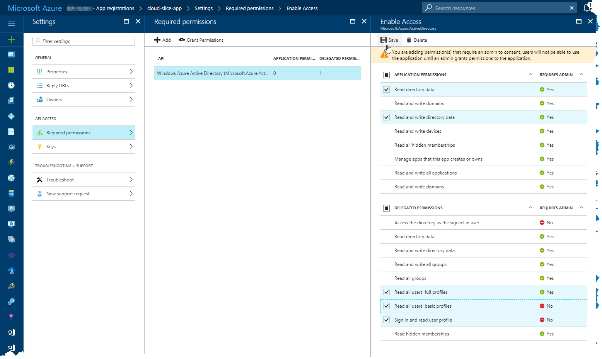
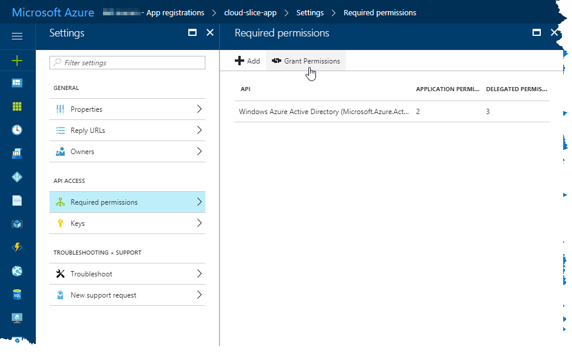
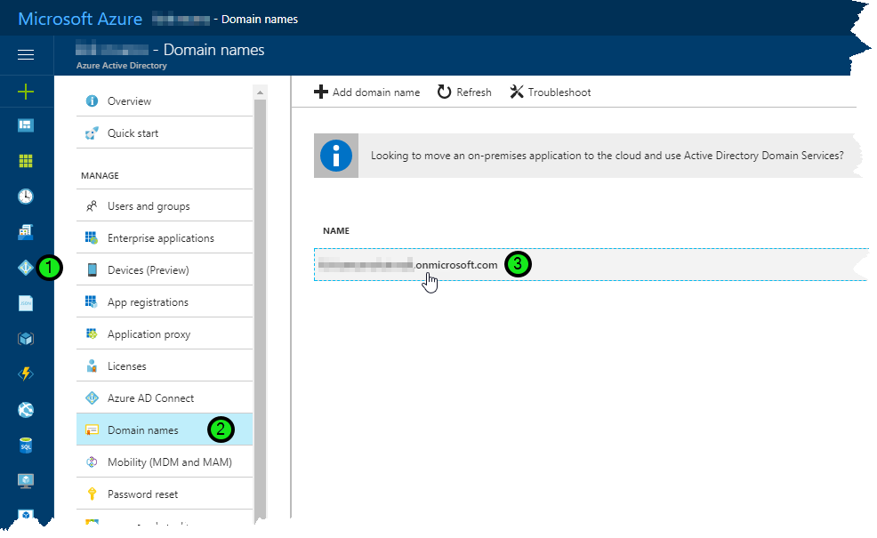

# Cloud Slice Guide - Microsoft Azure Setup

[Return to the Cloud Slice guide][back]

This document explains how to give the OneLearn Lab on Demand platform permissions to a Microsoft Azure subscription, so that labs can use that subscription to create a Cloud Slice. It is part of the Cloud Slice guide.

## Enable Cloud Slice support in your Microsoft Azure subscription

In Microsoft Azure, an application registration is used to create the subscription and resources contained in each Cloud Slice and to provide students with the user account that they will use to manage that subscription for the duration of their lab. In order to make this possible, this application registration must be configured as owner over a "master" Azure subscription, from which it will create each Cloud Slice subscription that is needed. As a best practice, you should create a separate Azure subscription (the "master" subscription) that will only be used for the provisioning of Cloud Slices.

To enable Cloud Slice support in your Microsoft Azure subscription (the "master" subscription), you must perform the following tasks:

1. [Create a new application registration in Azure Active Directory in your Azure subscription with a specific set of permissions][create-app-registration].
2. [Create an API key for your new application registration and copy subscription authentication details][create-api-key-and-copy-authentication-details].
3. [Add your application registration as an owner to the Azure subscription from which you want to provision Cloud Slices for your labs][add-app-registration-as-owner].

[create-app-registration]: #create-a-new-application-registration-in-azure-ad "Creating a new application registration in Azure AD"
[create-api-key-and-copy-authentication-details]: #create-an-api-key-for-your-application-registration-and-copy-authentication-details "Creating an API key for your application registration"
[add-app-registration-as-owner]: #add-your-application-registration-as-owner-to-your-azure-subscription "Adding an application registration as owner to your Azure subscription"

### Create a new application registration in Azure AD

To create a new application registration in Azure Active Directory, open the <a href="https://portal.azure.com/" target="_blank">Microsoft Azure Portal</a>, browse into the **Azure Active Directory** service, and click on **App registrations**. This will open the App registrations blade in the Microsoft Azure Portal.

With the App registrations blade open, click on **New application registration**. This will open a new blade from which you can create your new application registration.

In the Create blade, enter a name for your application registration in the **Name** field. Enter "https://labondemand.com/User/SignIn" into the **Sign-on URL** field. Leave the application type as the default value (Web app / API). Then click on the **Create** button to create the new application registration.

Once the application registration has been created, select it in the list of application registrations. If your new application registration is not showing in the list of available application registrations, click on **Overview**, then on **App registrations** to refresh the list. Once you have selected the application registration, a new blade will open showing the application registration properties.

In the Settings blade, click on **Required permissions** to show the Required permissions blade.

In the Required permissions blade, select **Windows Azure Active Directory** (note: this may be renamed as Microsoft Azure Active Directory in the future). This will display the Enable Access blade. Ensure that the following permissions are checked in the Enable Access blade:

| Permission Type             | Permission Name                |
| --------------------------- | ------------------------------ |
| **Application Permissions** | Read directory data            |
|                             | Read and write directory data  |
| **Delegated Permissions**   | Read all users' full profiles  |
|                             | Read all users' basic profiles |
|                             | Sign in and read user profile  |

Once those permissions have been checked, click the **Save** button at the top of the Enable Access blade.

Click on the **Grant Permissions** button to grant the permissions that you just configured to your application registration. This will result in a confirmation message being displayed in the portal.

Click on **Yes** to grant the permissions for the application registration. You may now close the Required permissions blade.

[Back to top][back-to-top]

### Create an API key for your application registration and copy authentication details

Now that you have your application registration created, and now that you have assigned appropriate directory permissions for that application registration, you need to create an API key for your application registration, and capture it for later. You will also need to capture your application registration's application id, your "master" subscription id, and your Azure Active Directory domain name (this is commonly referred to as your tenant name). These four pieces of information are required by the OneLearn Lab on Demand authentication process in order to allow it to provision Cloud Slices for your labs.

#### Create application registration API key

To create an application registration API key, you need to be in the application registration blade for the application registration you created earlier. If you are following this guide in order, you should already be there. From the application registration blade, you must do the following:

1. Click on **Keys** in the Settings blade to create a new key.
2. Enter a description for your key in the **Description** field and select an appropriate duration for your key from the values in the **Expires** drop down list. You should only set the duration to something other than "Never expires" if you want to periodically change your key before it expires while you do not have any Cloud Slice labs that are using that key that are currently in use.
3. Click on the **Save** button to save the key. Take care not to leave this view in the portal because you will need to be able to access the key that is displayed on save in the next step.

#### Copy your application registration application ID and API key

Once you have your application registration key created, you need to copy both the application ID and the API key. You can only do this at the time when you create the key (see the steps in the previous section identifying how to create an API key). Perform the following tasks to copy your application ID and API key:

1. Hover your mouse over the copy glyph that appears at the end of the Application ID and click to copy that value. Paste it in a document or credential management application where you track credentials so that you can access it later. Record this value as the Cloud Subscription Client ID.
2. Select the text in the value field of the API key and copy it. Paste it into the same document or credential management application where you track credentials so that you can access it later. Record this value as the Cloud Subscription Client Secret.

#### Copy your "master" Azure subscription ID

To copy your "master" Azure subscription ID for later, do the following:

1. Navigate to the Subscriptions service in the <a href="https://portal.azure.com/" target="_blank">Microsoft Azure Portal</a>.
2. Select the value in the Subscription ID field of your "master" Azure subscription and copy it. Paste that value into the same document or credential management application that you used earlier. Record this value as the Cloud Subscription Id. 

#### Copy your Azure Active Directory domain name

To copy Azure Active Directory domain name, do the following:

1. Navigate to the Azure Active Directory service in the <a href="https://portal.azure.com/" target="_blank">Microsoft Azure Portal</a>.
2. Click on the **Domain names** entry in the list of items you can manage.
3. Copy the domain name that you will use for your Cloud Slice subscriptions. Paste that value into the same document or credential management application that you used earlier. Record this value as the Cloud Subscription Tenant Name.

[Back to top][back-to-top]

### Add your application registration as owner to your Azure subscription

Once you have create your application registration and assigned appropriate directory permissions for that application registration, you need to add it as an owner of your "master" Azure subscription (the subscription from which you want to provision Cloud Slices). This can be done from within the <a href="https://portal.azure.com/" target="_blank">Microsoft Azure Portal</a>, by following these steps:

1. Open the **Subscriptions** service.
2. Select the "master" Azure subscription from which OneLearn Lab on Demand will create Cloud Slices.
3. Click on **Access control (IAM)** to open the identity and access management options for your subscription.
4. Click on the **Add** button to add permissions to your "master" subscription.
5. In the **Role** drop down list, ensure that Owner is selected.
6. In the **Select** field, enter the name of the application registration that you created for Cloud Slice management to search for that application registration.
7. Select the application registration in the list of search results that are displayed.
8. Click on the **Save** button at the bottom of the Add permissions blade to save the permissions you have selected.

[Back to top][back-to-top]

## Review Checklist

By now you should have completed the following:

- Created an application registration in Azure Active Directory.
- Assigned the required permissions to that application registration.
- Added the application registration as owner to your "master" Azure subscription.

You should also have captured the following pieces of information:

- Azure subscription ID
- Azure Active Directory domain name
- Azure application registration application ID
- Azure application registration API key

These values are required for the OneLearn Lab on Demand platform to be able to create Cloud Slices for your labs. If you are missing one or more of those values, or if you feel you did not complete one of the tasks listed above, review the steps in this document to find out what you missed.

[Back to top][back-to-top]

[Return to the Cloud Slice guide][back]

[back-to-top]: #cloud-slice-guide---microsoft-azure-setup "Return to the top of the document"
[back]: ../cloud-slice.md#enable-cloud-slice-support-in-your-cloud-platform "Return to the Cloud Slice guide"

