# Learn on Demand Systems Integrated Digital Lab v2 Authoring Guide 


## Introduction

This guide provides information on the Integrated Digital Lab Version 2 (IDL v2) Platform, the various elements that comprise a lab that uses this platform, the steps for converting a traditional IDL v1 based lab to an IDL v2 based lab, and some tips and best practices.

### Intended Audience

This guide assumes that the reader:

-   Has a developer account with sufficient permissions to create a lab guide and modify select properties of a lab profile.
-   Has existing knowledge of basic Markdown.
-   Has existing knowledge to navigate Lab on Demand (LOD)
-   Has a help desk support contract to pay for additional custom
    contract work.

# Overview of the Integrated Digital Lab version 2 (IDL v2) Platform


The IDL v2 platform integrates the lab instructions with the virtual machines (VMs) in the lab environment or Cloud Portal of choice, to guide the users in completing the lab. The IDL v2 platform allows users to view the lab instructions in line with the VMs or Cloud portal. 

An advantage of this presentation format is that the lab steps take up only a relatively small amount of screen real estate or can be displayed on a separate monitor. This removes the need to switch back and forth between a lab document and the lab’s Portal window. These activities distract from performing the lab and can take focus away from the lab steps and goals.

A successful lab that is well-received by users usually contains more than a simple set of basic lab steps or tasks. It will have significant explanatory content to provide context, background information, tips, cautions, and other useful and relevant information. Additionally, visual elements such as screenshots, videos, Alert dialogs and Knowledge blocks can add clarity and reduce the likelihood of error on the part of the user. The IDL v2 platform has the ability to include formatted text and visual content in a way that ensures the focus remains on the lab tasks and the context in which those tasks occur. The IDL v2 platform is authored using Markdown and enables the lab author to focus on content within the lab, instead of how to create a lab. 

## Launching a lab 

A lab launch may take anywhere from a few seconds to a couple of minutes to fully launch, depending on the Cloud platform chosen and/or the size and number of VMs (if using VMs). During this time, a window will appear with a message saying that the lab is ready. 

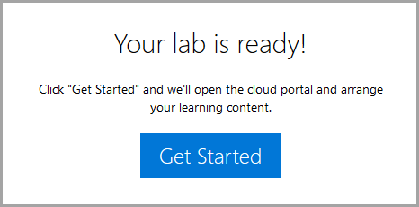

Clicking **_Get Ready_** will open close that window and open two other windows; the Portal window and the Lab Instructions, as shown in the [Overview of the Lab Interface](#Overview-of-the-lab-interface).

## Introductory content 

There are multiple ways to provide this introductory content, such as: dialog windows, embedded images or videos, external links or text. These are configured in the lab instructions (using [Markdown Syntax](#Markdown-syntax)) which are contained in the lab profile itself. You will learn about how to set up these kinds of content later in this document.

An introductory presentation can serve many different purposes. For example, you could use these features to provide:

-   General information on your products, services, and offerings

-   A specific introduction to the lab 

-   Tutorials

-   Information and cautions about upcoming lab step challenges,

-   Other kinds of content, such as static web pages, PowerPoint presentations and so on.

The IDL v2 platform can provide the user with an introduction that appears first, in the lab instructions when the user launches a lab. The introductory page can contain the objectives or goals that the user will achieve and a scenario that provides contextual information to assist the user to gain a deeper understanding of the lab. Upon lab launch, the introductory content should be displayed in the lab instructions, separated from the next page, using Markdown syntax.This is not a requirement of the lab if the lab author does not want to use an introduction in the lab. 

## Lab Instructions

A lab's instructions can be organized into one or more pages that represent a set of logically related tasks that result in the completion of some goal, or a lab can be organized into a combination of exercises and tasks, in no particular order. A lab task is usually a single step or a small set of closely related steps that form a unit. For example, a task might provide all the steps that a user must perform to complete a dialog box, or a task may be something smaller, such as logging into a portal or creating a file. 


You can add rich media content delivered from external sources (URLs) that the user can access at any point in the lab instructions, or embed video or images to provide additional context to the lab instructions. 

## Overview of the Lab Interface

This section describes the user lab interface. Within the lab interface on the right side, the lab instructions are displayed in their sequential order. When a task is performed that has a Task checkbox, the user clicks the checkbox. Tasks or any other items that the student is instructed to do can have a Task Checkbox (as shown in the image above) at the beginning of the item. Task Checkboxes are used track and report lab progress to LOD and TMS, as well as a visual marker for students. Lab progress is calculated by the percentage of Task Checkboxes that are checked in the lab instructions.

The right navigation pane contains the Lab Instructions, Resources and Help. The right navigation pane also allows users the ability to explore forward or backward from the current task they are performing. 

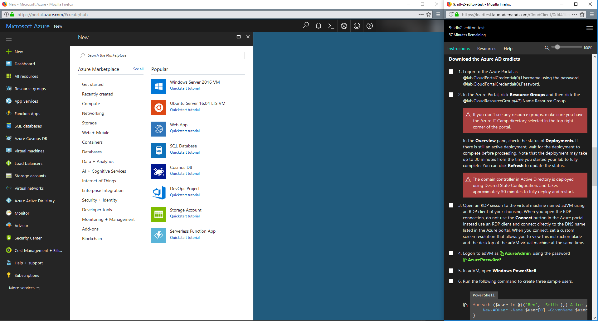

The left window is known as the **Portal Window**. This window can be configured to display any URL, in the lab profile configuration page. The URL of the Portal Window can changed during the lab, using Markdown syntax (discussed later in this guide).

- **Instructions Tab:** The Instructions tab allows the user to access the lab instructions.
- **Resources Tab:** The Resources tab allows the user to access resources provided in the lab profile, such as: URLs, virtual machines (if the lab uses virtual machines), and Floppy/DVD media (optional).

- **Help Tab:** The Help tab provides users with a unique lab ID, a link to submit a Support Request, as well as select a theme. In addition, users can easily gain access to FAQs for assistance.

## Adding Lab Content 

This section describes how to add content to the lab profile in the Learn on Demand Systems (LODS) platform. The later sections will cover how to add your content to a lab profile using Markdown.

### Enable Lab Profile for IDL

For a lab to display IDL v2 content, content must be enabled in the lab profile. To enable content in a lab profile, you need to perform the following steps.

1.  Click **Edit** on the lab profile page.
2.  On the **Basic Information tab** of the lab profile Edit page, check **Has IDL Content**.

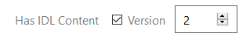

3. Click the up arrow to change the selection to **2**, to enable IDL version 2.

## Access IDL v2 Edit Mode

You are now ready to add lab instructions directly into the IDL v2 user interface. To add or edit content, lab content must be enabled for the lab profile (the **Has Content** check box must be checked).

### Check Out IDL Manual

Once lab content is enabled, you must the check out the IDL v2 lab instructions. Checking out the IDL v2 lab instructions ensures that only one person at a time can make changes to the content.

To check out the IDL v2 manual, navigate to the lab profile page, and then click **Check Out**.

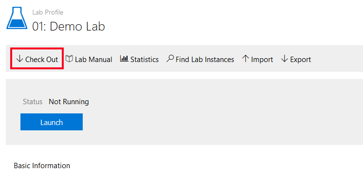

Once you have checked out the IDL manual for editing, you can begin adding and editing content.

### Edit Instructions

When using this option, a new page will open with a text editor and a preview pane. This gives you the ability to create lab instructions, and see a live preview of how they will be displayed to the user during the lab. To edit the lab instructions, click **Edit Instructions**, as shown below.

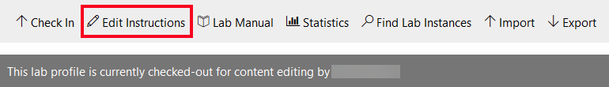

In this mode, only the manual opens for editing; the Cloud Client has not been launched and no VMs are running. 

### Advanced Settings

In addition to the Basic Information tab, the Advanced tab has settings that are relevant to lab manual creation and display.

To gain access to the Advanced settings, on the lab profile page:

1. Click **Edit** on the lab profile page.

2. Click **Advanced**. 

   The advanced settings tab allows you to configure the following:

- **Custom Cascading Style Sheets (CSS).** You can use CSS to modify the appearance of the lab text in the navigation and task bars. CSS markup that will be included in the lab client, making it possible to control the styles of custom content that is added to the lab. This should just be the style definitions, including a style tag is not necessary. 

- **Custom CSS URL:** A URL to an externally hosted CSS stylesheet. The stylesheet will be referenced in the lab client. **HTTPS is required**.

- **End Redirect URL:** If this value is set, users will be redirected to the specified URL when the lab ends. This feature isn't used often, but can help a lab fit into an external workflow. 

  For more information on Custom CSS in Lab on Demand, see our guide here: [Custom CSS Guide](create-lab-profile-custom-css).

- **Max Active Instance:** This sets the amount of concurrent labs that can be launched at a time. Setting to _Unlimited_ allows an unlimited amount of launches of this lab profile at a time. Entering a number limits the amount of concurrent labs to the number specified. Any labs that are attempted to be launched after the limit has been met, will be given an error message and will not be able to launch the lab until the number of labs launched is below the maximum amount.

- **Show Timer:** Checking this box will enable the lab to display a countdown timer, showing the user how much time they have left to complete the lab. 

- **Enable Navigation Warning:** A warning will be displayed if the user navigates away from the lab client before the lab is complete.

- **Show Navigation Bar:** 

- **Navigation Bar Width:** This sets the width of the navigation bar in the lab UI. Options include:

  - Default (250 pixels)
  - Large (400 pixels)
  - XL (600 pixels)
  - Custom

- **Show Content Tab:** Checking this box enables the Content tab to be displayed in the lab environment.

- **Show Machines Tab:** Checking this box enables the Machines tab to be displayed in the lab environment.

- **Show Support Tab:** Checking this box enables the Support tab to be displayed in the lab environment.

- **Custom Content Tab label:** Custom label to be used in lab UI, in place of the Content tab.

- **Custom Machines Tab label:** Custom label to be used in lab UI, in place of the Machines tab.

- **Custom Support Tab label:** Custom label to be used in lab UI, in place of the Support tab.

- **Custom Errata Label:** Custom label to be displayed on the [Errata](#Errata).

- **Enable Copy & Paste:** Enables Type Text

- **Show Virtual machine Power Options:** Checking this box enables virtual machine power options to be available to users.

- **Require Hyper-V Enhanced Controller:** Checking this box requires the user to use the Hyper-V Enhanced controller to work in the lab. If this box is checked, users will not be able to use any other machine remote controllers. Note that the Hyper-V enhanced controller only allows one user to access the lab at a time. 

- **Enable Instance Link Sharing:** When enabled, the lab instance URLs can be shared between users. If a user copies the URL from their browser's URL bar, they can send it to another user, or open it in a different browser. Note that most virtual machines only allow one user to access them at a time. This setting does not bypass the connection limitations of virtual machines.

- **Shared Class Environment:** Shared class environments allow multiple lab instances to be bound together with one or more shared networks and resources. A shared class environment consists of at least two different lab profiles, each serving a particular role. 

  - **Shared Environment:** One lab is configured to serve as the shared environment. Exactly one instance of this lab will run per class. 
  - **Participant:** This is the lab that end-users will launch. There can potentially be more than one lab in this role per class, but they will all connect to the same shared environment instance. 

  Networks within the shared environment lab can be made available to participant labs, making it possible for participants to connect to each other and/or to virtual machines within the shared environment. To enable Shared Class Environment for this lab profile, select one of the options from the drop-down menu; _Shared Environment_ or _Participant_. For more info click here: [Shared Labs Guide](https://github.com/LearnOnDemandSystems/guides/blob/master/sl/sharedlabs.md)

- **Save/Cancel Options:** 

  - **Allow User to Cancel Labs:** allows the user to cancel the lab at any point
  - **Allow user to Save labs:** allows the user to save the lab in it's current state and return at a later time. Note that saved labs are only saved for 48 hours. Users can extend the saved lab expiration by resuming the lab and saving again. Each save sets the timer back to 48 hours. After 48 hours has passed, the lab progress and components are discarded and cannot be recovered. 
  - **Allow User to Extend Time Remaining:** Allows the user to extend the time remaining in the lab environment. 
  - **Auto-Save incomplete Labs:** Enables the lab to automatically save incomplete labs after a specified amount of time has passed. 

- **Save/Cancel Labs When Last Console Sync Exceeds:** 

- **Save/Cancel labs when last Activity Exceeds:** 

- **Activity Required to Enable Auto-Save:** 

- **Minimum Time Given to Saved Labs:** 

- **Maximum Allowed Snapshots:** 

- **Life Cycle Actions:** Actions can be defined to occur at certain points in the lab life cycle. For instance, an external service could be called when the lab builds, or send a notification to the user when the lab is resumed. 

- **Lab Host tags:** Lab host tags are used to specify which Lab Host(s) the lab profile will use when users launch the lab. The Lab Host tag must already be created to add it to the lab profile using this button.

## Create Lab Instructions

Content is created using a combination of Markdown and plain text. HTML can also be used alongside or in place of Markdown elements. The following describe various items used to create lab content with IDL v2.

## Using the Lab Editor

The image below shows what will be seen after clicking **Edit instructions**, as discussed in the previous section. This text editor is where all of the lab content is written and stored. The left side of the editor shows the raw syntax of the lab content, whereas the right side shows how the lab content will be rendered and displayed to users.

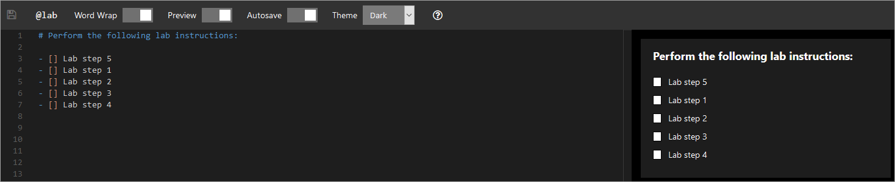

- **Disk icon:** click to save current progress
- **@lab:** Replacement Tokens are used to create a placeholder, to later insert information into.
- **Word Wrap:** toggle to enable or disable Word Wrap.
- **Preview:** toggle to enable or disable the Preview of rendered Markdown.
- **Autosave:** toggle to enable to disable auto-saving of work. 
- **Theme:** select a theme to style the text editor to your preference.

### Headings

Headings are useful to identify and separate sections of lab instructions. For section titles, you should use title case (see Common Style Guidelines for a definition of title case).

### Introduction Message

The introduction message provides information about the goals of the lab, what the lab user will accomplish in the lab, and puts the lab tasks into a context. Dialog prompts, embedded images or videos, external links or text are commonly used.

#### Objective and Scenario Best Practices and Guidelines

The Objective is used to provide specific information about the lab. It should include a summary of the lab instructions and a list of specific goals that the lab is intended to meet. In contrast, the scenario serves a more general purpose. It can, for example, be used to establish the context in which the lab tasks are performed or to provide more general background information.

- Use bulleted or numbered lists to emphasize lab goals and objectives.
- Ensure lists are expressed in parallel grammatical format and start with verbs to provide greater emphasis and clarity.
- Provide a summary of the entire lab.
- Ensure that goals are focused on what the user gains from doing the lab.
- Use a scenario to provide more general background information and context.

### Completion message

A completion message provides a brief summary and congratulatory message to the lab user. This is accomplished by creating a dedicated page in the lab instructions, using Markdown. This should be the last or next to last section in the lab. As a best practice, you should indicate that the user should click Continue to proceed to next page.

### Lab Instruction Placement

You have the option of creating the lab instructions after the current instruction, if present, or as the last instruction in the lab.

-   Note that if you have multiple lab instructions, you can change the order from within the user interface. To change the order of a task, copy the syntax of the lab instruction and paste into the correct location, using keyboard shortcuts (CTRL+C, CTRL+V).

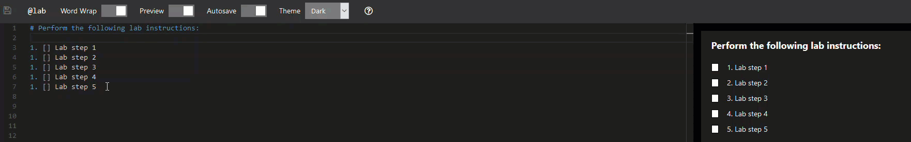

## Markdown Syntax

Markdown is an easy to use markup language to format text, that offers multiple ways to achieve the same result. Markdown was designed to be easy to learn as well as be easy to read and write. When creating IDL v2 lab content, you may use Markdown to format text. Markdown allows the author to keep their hands on the keyboard and focus on writing content. Markdown supports HTML, and HTML syntax can be used in combination with Markdown. You can use the following Markdown syntax  to perform formatting.

### Headings

Markdown allows for text to be resized by typing 1-6 # (hash or pound) symbols in front of the text that is to be resized, followed by a space. One # renders the largest text size, while six # symbols renders the smallest text size.Typically this is used at the beginning of a paragraph or section in a document, to make the title stand out from the rest of the text. 

> - # Heading1
>
> - ## Heading2
>
> - ### Heading3
>
> - #### Heading4
>
> - ##### Heading5
>
> - ###### Heading6

### Text Formatting

- **Indent size**: pressing the tab key will indent 4 spaces. 

- **Single space**: pressing the tab key at the end of a line will single space the next line. Alternatively, pressing the space bar four times will single space the next line. 

- **Double space:** leaving no spaces at the end of the line will double space the next line. 

- **Bold**: used to show emphasis. Type two * (asterisk) symbols on each side of the text that is to be bolded.

  > \**Bold text**

- **Italic**: used to show emphasis or distinction. Type two _ (underline) on each side of text that is to be emphasized.

  > \_Italic text_

- **~~Strikethrough~~**: used to mark text that should not be included, but should not be removed from the document. Type two ~ (tilde) symbols on each side of text that should show a strikethrough.

  > \~~Strikethrough text~~ 

- **Escape character**: used to prevent text from being formatted into Markdown. Type a \ (backslash) at the beginning of the text that is to be escaped. 

  > \escaped text

- **Bullet**: used to separate and order  items in a list without using numbers

  > `-`

- **Inline code block**: used to provide a snippet of code that can be copied and pasted. Type a ` (backtick) on each side of the text that is to be displayed in the code block. The backtick is located above the tab key, to the left of the 1 key on the keyboard.

  > <code>`code block`</code> 

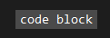

- **Fenced code block**: used to provide a programming language-specific code snippet. Type three ` (backticks) on each side of the text that should be displayed in the fenced code block. This should consume at least 3 lines in the text editor; the first line should display three backticks followed by the programming language name, the second line should display the code snippet, and the last line should only display three backticks. Markdown allows for more than one line to be used to display the code snippet. 

  > ```fenced_code_block
  > ​```PowerShell
  > get-service | stop-service -whatif
  > ​```
  > ```

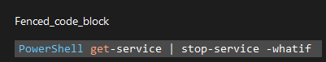
### Link formatting

- **Internal link**: Used to link to a specific section within a document. 

  > \[text to display](#link-location "optional link title")

- **External link**: Used to link to a page outside of the document.  

  > \[text to display](url "optional link title)

- **Relative link**: used to link to a page in the same directory without the need to display the full URL of the page.

  > \[text to display](../folder/file.htm "optional link title")

- **Reference link**: used to provide a link that will be referenced multiple times. The link can be referenced by typing the text value between the [ ] (square brackets). It is not necessary to include the full URL, as long as the text value in both sets of brackets is the same.   

  - **_Text lookup_**: 

    > \[Reference link text value]
    > \[Reference link text value]: URL "Optional link title"

  - **_Label lookup_**:

    > \[Reference link][Name of URL]
    > \[Name of URL]: URL "Optional link title"

  - **_Footnote style_**:

    > \[Reference link][1]
    > \[1]: URL "Optional link title"

### Page formatting

- **Page break**: Used to separate content into pages. Separating into pages creates a next button that the student must click to navigate to the next page. This is useful for displaying small sections of instruction to the student at a time, rather than all instructions on the same page within the lab. Type three = (equals) symbols on the line where the current page should end. The new page will begin on the line following the three = symbols.

  > ===

- **Horizontal Line**: Used to separate content on the same page. Type three --- (dash or hyphen) on the line where the horizontal line should appear. 

  > \---

- **Block quote:** Used to quote information from other sources. Block quote text appears indented from other content in the document. Type a > (greater-than sign) before text that should appear in the block quote. Most Markdown syntax will render inside of block quotes.

  > \> text here
  >
  > \> additional text here

### Embedded content

- **Image**: Used to embed an image inline with other content. When images are clicked, they will open in a new window and display at the images full resolution.

  > \!IMAGE[text to display]\(url)

- **Video:** Used to embed a video inline with other content. The syntax format should look the same as an image, except the video should begin the word VIDEO (all caps).

  - Videos are used to provide rich media content, such as short, step-specific videos, that can serve a variety of purposes: to demonstrate a series of steps, to assist visual learners, to provide clarity, to provide additional information and others. Videos showing the steps in the task are particularly useful for difficult and complex tasks as well. 
  - The video can be any URL that points to a video. Videos that are hosted on YouTube will be embedded in the lab instructions, and do not need to open in a separate window, for the video to play. Alternatively, you can link videos hosted by other sources in the lab instructions, using Markdown syntax.

  The following are some guidelines for creating videos that are associated with lab tasks:

  - Keep the video short, between 30 – 60 seconds at most.
  - Make sure the video covers only the relevant step.

  > \!VIDEO[text to display]\(url)

- **Image with link:** Used to embed an image that can be clicked to navigate to a specific URL (internal or external). 

  > \[![text to display]url or filepath "Optional image title")]url "Optional link title")

- **Portal Link:** used to launch a hyperlink. In the Cloud Client, this will open the hyperlink in the left window (Portal window). In the traditional virtualization client (vm-based labs), this will open the hyperlink in a new local browser window.

  > `<[text to display](URL)`

- **Image Link:** used to display a link with a camera icon, to suggest that the hyperlink opens an image. Opens in a new window.

  > `IMAGE[text to display](URL to image)`

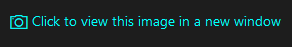

- **Video Link:** used to display a link with a videocamera icon, to suggest that the hyperlink opens a video. Opens in a new window.

  > `VIDEO[text to display](URL to video)`

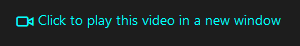

### List formatting

- **Unordered list:** Used to list items in no particular order, separated by bullets rather than numbers. Type a - (dash or hyphen) followed by a space and then the text to be listed. Pressing enter at the end of the text will start the next line with a bullet. 
- **Ordered list:** Used to list items in a particular order, separated by numbers rather than bullets. Type the number 1, followed by a space and then the text to be listed. Pressing enter at the end of the text will start the next line with number 2.
- Both Unordered and Ordered lists can contain Task Checkboxes for the student to check off steps as completed. Both list types can be combined in the same list. Task Checkboxes are used track and report lab progress to LOD and TMS, as well as a visual marker for students. Lab progress is calculated by the percentage of Task Checkboxes that are checked in the lab instructions.

#### Unordered list **without** Task Checkboxes:

```
- Item 1
    - Item 1.1
        - Item 1.1.1
        - Item 1.1.2
    - Item 1.2
- Item 2
```

#### Ordered list **without** Task Checkboxes:

```
1. Item 1
    1. Item 1.1
        1. Item 1.1.1
        1. Item 1.1.2
    1. Item 1.2
1. Item 2
```

#### Unordered list **with** Task Checkboxes:

```
- [] Item 1
    - [] Item 1.1
        - [] Item 1.1.1
        - [] Item 1.1.2
    - [] Item 1.2
- [] Item 2
```

#### Ordered list **with** Task Checkboxes:

```
1. [] Item 1
    1. [] Item 1.1
        1. [] Item 1.1.1
        1. [] Item 1.1.2
    1. [] Item 1.2
1. [] Item 2
```

### Table formatting

- Tables can be aligned left, right or center by placing a : (colon) on the head row of the table. Placing a colon on the left side, right side or both sides of the dashes in the header row, will align the text in the table accordingly. 

**Left-aligned text**

```
| column 1 | column 2 |
|:---------|:---------|
| data 1   | data 2   |
| data 3   | data 4   |
```

**Right-aligned text**

```
| column 1 | column 2 |
|---------:|---------:|
| data 1   | data 2   |
| data 3   | data 4   |
```

**Center-aligned text**

```
| column 1 | column 2 |
|:--------:|:--------:|
| data 1   | data 2   |
| data 3   | data 4   |
```

### Special formatting

- **Knowledge Block:** Used to provide additional information, to help students better understand lab steps or lab content. It can also be used to provide alternative instructions or store commands that you want users to enter. Knowledge blocks are limited to only show 4 lines of the lab content. After 4 lines, a _more_ link will be shown, allowing the student to expand the Knowledge Block and review additional information.

  -  If you use the Knowledge box for lab steps or a series of commands, please make sure you include a note directing users to execute the steps or commands there. (For example, “At the PowerShell prompt,type the commands listed in the Knowledge box, pressing ENTER after each one.”)

  > \> [!KNOWLEDGE] knowledge text here.

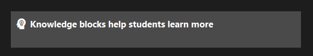

- **Alert:** Used to draw attention to important issues, such as showing additional information or steps that the student may need complete to avoid other issues. Alerts are useful whenever you want the users to pause and take note of additional and important information. From the user’s perspective, alerts are mandatory because they will appear inline in lab instructions. 

  > \> [!ALERT] alert text here.

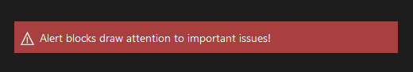

- **Note:** Used to provide additional information, similar to a Knowledge Block, with the only difference being that Notes do not collapse and show a _more_ link to expand the section. 

  > [!NOTE]

- **Dialog:** Used to open a dialog popup, to display additonal information. This can be useful to make additional information available to the student.

  > ^[Text to display in lab  instructions][Reference Link]

  > \>[Reference Link]:

  > \>This appears in the Dialog

- **Commands:** Used to target the Portal window to input commands. To mitigate risk of error and to enhance the overall experience of the lab, the IDL v2 platform supports executing commands directly in the area of focus of the Portal window. Clicking the text in the lab instructions will input the command into the item in focus, on the Portal window. Commands can be a single line (shown below) or multi-line. 

  - Commands can perform any action that is possible to do from a command or Windows PowerShell prompt. For example, the command could open File Explorer at a particular location within a directory structure, open dialog boxes, start scripts, open documents and web pages, and many others. 

    Although potentially any task could be reduced to an action that can be executed as a command shell or Windows PowerShell command, you should use this feature judiciously. Users should still know how to open File Explorer and perform other basic actions. This feature is most useful for a complex task that involves numerous steps, opening
    file locations deep down in directory structures, opening specific Web pages, and other similar activities.

    There are 4 different kinds of commands that you can configure:

    - **Type Text**. This is not a command per se. Rather, this command
      type allows the user to copy a predetermined string to the VM.
    - **PowerShel**l. This allows the user to execute a PowerShell command
      in the background. The user does not see the execution of the
      command.
    - **PowerShell will UI**. This opens a command prompt window in the VM
      and shows the command execution.
    - **Shell**. This causes a command to be executed in the background.
      The user does not see the execution of the command.
    - **Shell with UI**. This command opens a command prompt window in the
      VM and shows the command execution

To initiate the Command , the lab user clicks on lightning bolt) icon in the lab instructions, as shown below.

  > ```
  > @[Text to display](`command`)
  > ```

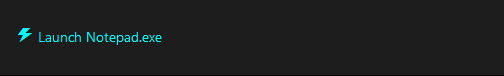

- **Include:**  Used to input text from a GitHub raw link. This is useful to use to pull in content hosted on GitHub. Navigate to the GitHub page containing the content to be used, click the Raw button, then copy the URL of that page and include it in the below syntax. 

  **Note**: GitHub hosted content can be changed by the repo maintainer of the content and will change the instructions displayed in the lab using the _Include_ syntax. 

  > `[!INCLUDE [label](url)]`

- **Copyable Text:** Used to make text copy to the local clipboard when the student clicks the text. Type two + (plus) symbols on each side of the text that should be made copyable. 

  > \++copyable text++

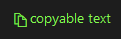

- **Type Text:** Used to target the Portal window to input text. Clicking the text in the lab instructions will input text into the item in focus, on the Portal Window Type three + (plus) symbols on each side of the text that should be made into Type Text. 

  > \+++Type Text+++

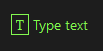

- **Embed YouTube video:** Used to embed a YouTube video inline with the lab instructions. URLs from YouTube.com automatically embed. Videos from any other URL will not embed.

  > `!VIDEO[text to display](url)` 


- **Replacement Token:** Used to replace text in lab instructions with a variable that is unknown at the time of authoring the lab instructions. These variables may not be generated or created until the lab is launched by the student. These can include usernames, user first name, user last name, running lab instance ID number, etc. 

  > | Replacement token           |                                          |
  > | --------------------------- | ---------------------------------------- |
  > | @lab.LabInstanceId          | The unique ID of the running lab instance. |
  > | @lab.GlobalLabInstanceId    | The globally unique ID of the running lab instance. |
  > | @lab.LabProfileId           | The unique ID of the lab profile.        |
  > | @lab.UserId                 | The unique ID of user running the lab.   |
  > | @lab.UserFirstName          | The first name of the user running the lab. |
  > | @lab.UserLastName           | The last name of the user running the lab. |
  > | @lab.UserEmail              | The e-mail address of the user running the lab. |
  > | @lab.UserExternalId         | The external ID of the user running the lab (if launched via API). |
  > | @lab.Tag                    | The tag associated with the lab instance (if specified when launched via API). |
  > | @lab.CloudPortalLink        | A link to the cloud portal.              |
  > | @lab.CloudPortalUrl         | The cloud portal URL (rendered as text, not a link). |
  > | @lab.CloudPortalSignInLink  | A cloud portal sign-in link.             |
  > | @lab.CloudPortalSignInUrl   | The cloud portal sign-in URL (rendered as text, not a link). |
  > | @lab.CloudPortalSignOutLink | A cloud portal sign-out link.            |
  > | @lab.CloudPortalSignOutUrl  | The cloud portal sign-out URL (rendered as text, not a link). |

### Tasks

For task titles, you should use sentence case (see Common Style Guidelines for a definition of sentence case).
Your titles should be as concise as possible. The following are some best practices for task titles:

- Keep title under 50 characters
- Start with a verb
- Use telegraphic style. Remove words, such as “a”, “an”, “the”, “is”
  or “are”, that are not required to convey accurate meaning. For
  example, write “Verify account listed”, rather the “Verify account
  is listed.”

The following are some best practices for creating tasks:

-   Avoid creating a single task for actions such as completing wizards that use multiple screens. Try to limit tasks to actions performed in single screens, pages, or dialog boxes.
-   If the task requires users to type in a long command or series of commands, place the commands in [Command](#Commands) syntax or a Code Block. In the task, ask users to open click the Command button that is generated by the Command syntax or clicking the code block, which will copy to the user's local clipboard, so they can past into the appropriate part of the lab.  
-   Use bolding to: 
    -   Emphasize the user interface elements the user interacts with,
    -   Highlight what the user types into a field.\
        For example, “Type **Passw0rd!**” or “Click **Submit**.” 

### Screenshots

Screenshots add clarity by providing a visual representation of what a completed task looks like. Screenshots are also beneficial for people who are visual learners or do not speak the authored language as their first language. This helps to mitigate the risk of configuration errors. When the user clicks the screenshot in the lab instructions, it will open in a new window, at full resolution. Opening the screenshot in a new window is useful if the screenshot is large. If the screenshot is particularly important or noteworthy, students can save or bookmark the URL of the image for later use.

To create a screenshot:

1. Make sure the lab profile is **checked out**. 

2. **Launch** the lab.

3. Click the **menu** button in the upper-right corner of the lab UI.

4. Click **Edit instructions**.

5. Place the mouse cursor where the screenshot will go in the lab instructions.

6. Adjust the size of the window the VM is displayed in, as well as the placement any windows in the VM, before taking the screenshot. 

7. Take a screenshot by **clicking the Screenshot button**, in the UI, as shown below.

   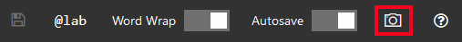

**Note:** the screenshot is captured at the size that the VM is sized to,  when screenshot button is clicked. 

If you use this method, the screenshot is automatically added in the lab instructions where your mouse cursor is. Please keep in mind that when you take a screenshot using this method, you take a screenshot of the entire desktop of the VM, which may not be desirable. 

The following are some best practices for incorporating screenshots into your lab:

-   Compose the various elements (dialog boxes, etc.) before taking the screenshot so that all the important fields are visible.

-   Avoid taking screenshots of the entire desktop. For example, if the focus of interest is a dialog box or a page, maximize the element to avoid including too many other elements in the screen that may distract from the object being configured in the task.

-   Do not cover menu labels with context menus that appear when you right-click.

-   Consider highlighting elements in the screenshot that are of particular importance.

-   Make sure that titles of items, dialog boxes, pages, etc. are clearly visible.

### Virtual Machine Select

During a lab, a lab user may be required to perform configuration steps on two or more VMs. A common source of errors in labs is performing lab tasks on the wrong VM. The IDL v2 platform mitigates this risk by providing the means to change to the correct VM within a task, by clicking a link in the lab instructions or selecting a VM from the Resources tab.

The virtual machine Replacement Token allows the user to make a different VM active, by clicking a link in the lab instructions. Although this functionality is also available from the Resources tab, the advantage of the using the virtual machine Replacement Token is that the lab user can switch the active VM from within the task itself.

##### VM displayed **in lab instructions** using a Replacement Token. 

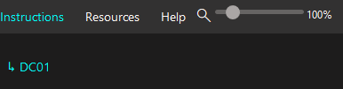

To add a virtual machine to the lab instructions using a Replacement Token:

1. Place the cursor where the link to the VM will go in the lab instructions. 
2. Click **@Lab** at the top of the text editor.
3. Select the virtual machine to be used. (refer to the description column of the Replacement Token menu for VM details).
4. Click **Insert**.

##### VMs are displayed on the Resources tab, based on the lab profile configuration. 

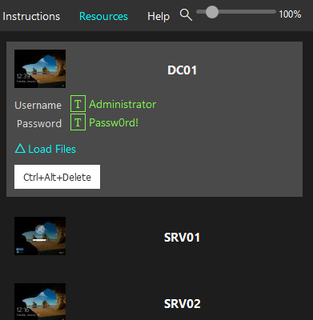

### Removable Media

The **Floppy Drive Replacement Token** provides a link for the lab user to insert a virtual floppy disk into (or eject from) the VM. The advantage of using the control is the user can insert the virtual floppy disk from within the task itself.

The **DVD Drive Replacement Token** provides a link for the lab user to insert a virtual DVD (ISO file) into (or eject from) the VM. The advantage of the using the control is the lab user can insert the virtual DVD from within the task itself.

To add removable media to the lab instructions using a Replacement Token:

1. Place the cursor where the link to the removable media will go in the lab instructions. 
2. Click **@Lab** at the top of the text editor.
3. Select the removable media to be used. (refer to the description column of the Replacement Token menu for media type details).
4. Click **Insert**.

## Add Review Questions as an Assessment Exam to a Lab

### Exams

Each lab, regardless of whether it has content, can provide an optional exam at the end of lab. This can serve a number of purposes: to reinforce learning, to measure retention of concepts, to provide metrics on effectiveness of lab delivery, etc. Exams are categorized by the type of scoring used; there are three to choose from:

1. **Assessment** - Traditional multiple choice test that is scored automatically.

2. **Manual** - The user submits screenshots.The screenshots are later evaluated and marked by an examiner.

3. **Automated** - Performance-based test (the user has to make required configuration changes in the lab based on directions in the exam questions) that are evaluated using scripts to verify correct configuration within the lab or in code. 

Review questions can be added to a lab as an assessment. The assessment will appear when the user has completed all the lab steps. It is created on the Exam tab of the lab profile. To create an assessment, click the
**Exam** tab, and then check **Has Exam**. 

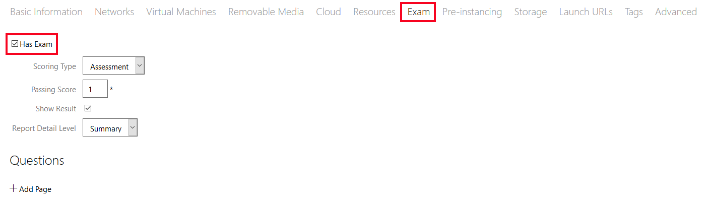

To create a multiple choice review, in the Scoring Type drop-down, select **Assessment**, set the **Passing Score**, and then click **Add Page**. Pages provide a way to organize the review content into categories that, for example, might follow the lab exercises or topics. Enter a page name and click **Add Question**. Type the question, add the multiple choice selections, select the correct answer(s), and set the **Score Value** so that the exam can be scored.

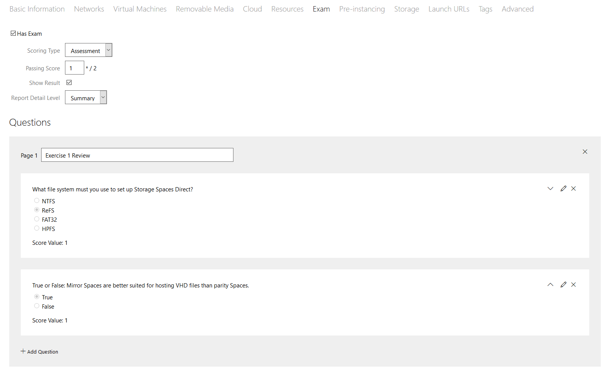

## Additional Features

### Converting a traditional IDL v1 based lab to an IDL v2 based lab

Traditional IDL v1 labs can be converted to IDL v2 labs easily in Lab on Demand. The conversion process does not convert some items correctly, and you may still need to look over the content to ensure everything appears as expected. Converting to IDL v2 is not permanent and can be reverted back to IDL v1 at any time, from the lab profile page. To revert the lab back to IDL v1, toggle the version selection on the Basic Information tab, on the edit lab profile page.

To convert an IDL v1 lab to IDL v2:

1. Navigate to the **lab profile** page.

2. Click **Upgrade** next to **Has IDL Content**. (this will display the current version of the lab profile)

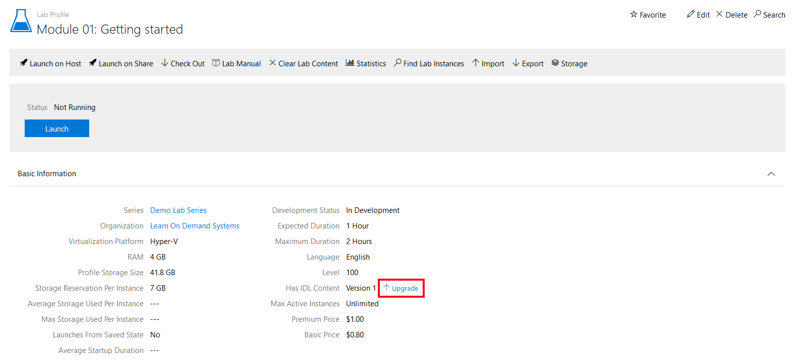

3. Select how screenshots and videos should be converted. They can be converted **inline** (recommended) or **as links**.

   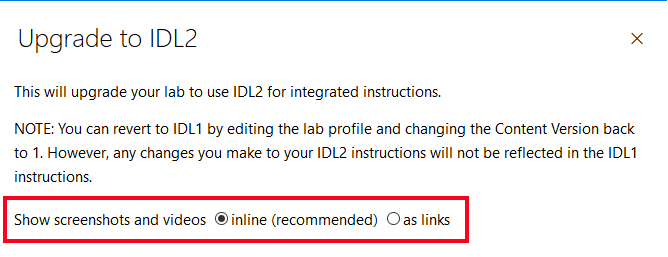

   4. After making a selection, **Click OK** to convert the lab to IDL v2.

      The lab is now IDL v2. You can confirm by checking the **Has IDL Content** field on the lab profile **Basic Information** section. 

### Create and Incorporate Advertising Campaigns

An advertising campaign allows you to provide introductory content across multiple labs that are grouped by lab series, organization or event. This topic describes how to add an advertising campaign to a lab profile or a lab series. The advertising campaign must first be configured from the Lab on Demand Admin page, as show below.

-   You will require special permissions to see this tile.

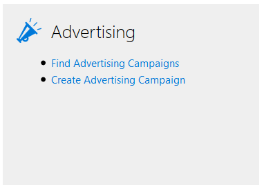

To create an advertising campaign, click **Create Advertising Campaign**. On the edit, enter a name for the campaign, as shown below.

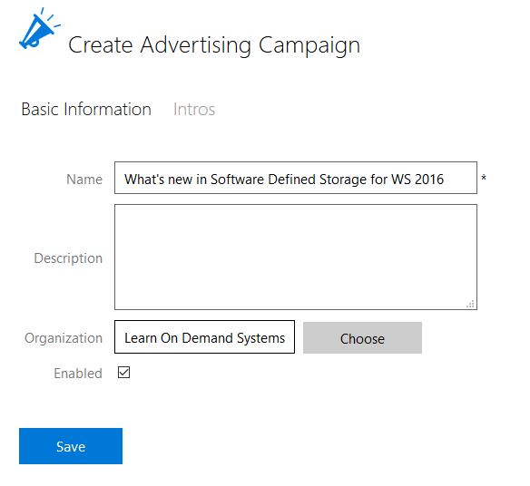

Click the **Intros** tab and enter the URL source for the video, graphics presentation, or other information you wish to display. Multiple URLs can be entered on separate lines and will display randomly. If wanted, check the box and set the minimum amount of time to show the content. With this configured, the users will not be able to close the presentation early.

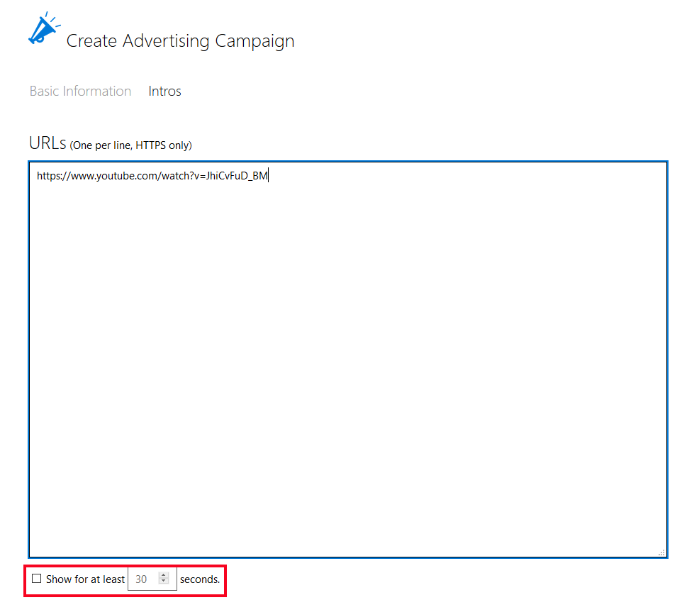

To configure a lab profile with an advertising campaign, on the lab profile page, click **Edit**.

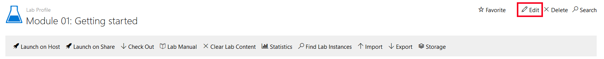

Beside Advertising Campaign, click **Choose**, then locate and select the advertising campaign.

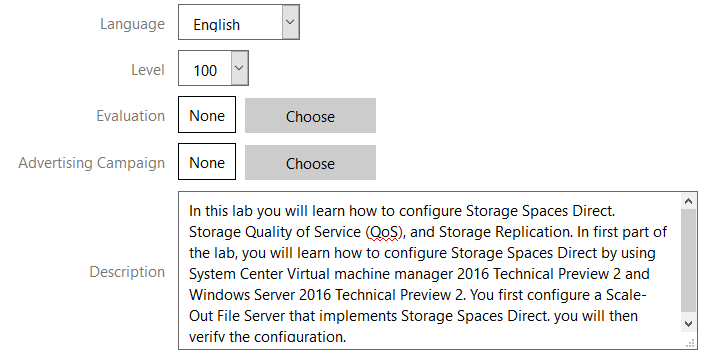

The advertising campaign can also be associated with a lab series or a lab profile. The following screenshot shows the configuration page for an example lab series.

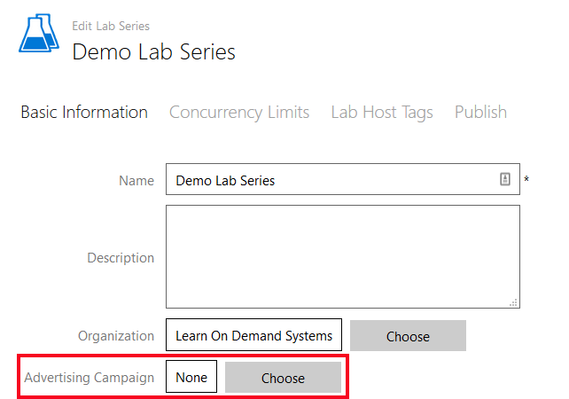

### Incorporate Rich Media Content as Part of Lab Introduction

Although you can use Advertising Campaigns at the level of the lab profile, it is more practical and easier to use the Introduction Content URL to provide a lab-specific video or other rich media content.

To do this, on the Edit Lab Profile page, scroll down and type the URL for the rich media content in the **Introduction Content URL** field. Like the advertising campaign, you can also force the rich media to be displayed for a minimum amount of time by checking the box to Show for at least **__** seconds.

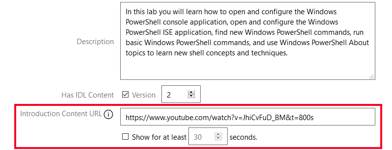

## Common Style Guidelines


This section includes guidelines for preventing common errors in word
choice and sentence formation. The list contains some of the most common
errors in grammar, language, style, and formatting. Use this section as
a quick reference as you write or edit. For more comprehensive
information on, and guidelines for writing about technical information,
please see the Microsoft Manual of Style (MMS), 4^th^ edition.

| Use                                      | Do Not Use                               | Comments                                 |
| ---------------------------------------- | ---------------------------------------- | ---------------------------------------- |
| VMs                                      | VM's                                     | Do not use an apostrophe when you mean plural.<br/><br/>This is the possessive form. |
| Red, white, and blue                     | Red, white and blue                      | Always include the serial comma, which is the comma before a coordinating conjunction such as "and" or "or." |
| In Server Manager, click **Manage**, and click **Add Roles and Features**. | In Server Manager, click **Manage**, then click **Add Roles and Features**. | *Then* is not a coordinate conjunction and thus cannot correctly join two independent clauses. Use *and* or another coordinate conjunction or *then* with a semicolon or another conjunctive adverb to connect independent clauses in, for example, two-part procedural steps.<br/><br/>This is one of the most common grammatical errors in lab documents. |
| Some applications are unable to use expanded memory. | Some applications are unable to utilize expanded memory. | Do not use *utilize* as a synonym for *use*. *Utilize* means "to find a practical use for." |
| On the File menu, click **Open**.        | On the File menu, select **Open**.       | Use *click* rather than *choose* or *select* to refer to the user action of issuing a command or setting an option. |
| On the View menu, point to **Toolbars**, and then click **Formatting**. | On the File menu, choose **Open**.<br/><br/>Click on **Save**. | When dealing with menus and submenus, do not use *click on*, only *click*. |
| Check the **Print all pages** check box. | Check the **Print all pages** checkbox.  | If using the term check box, this is two words. |
| For more information about...            | For information on...                    | In cross-references, use *about*, not *on*. |
| To ..., click ….                         | Click … to....                           | Begin the sentence with "To".            |
| web, website                             | Web, web site                            | Change to MMS, 4^th^ edition, is web in lower case, and website all one word. |
| All caps for A.M., P.M., and key names, such as CTRL, ALT, and DELETE | Small caps, or title case.               | Note use of periods in A.M. and P.M., per MMS. |
| The **Save as** dialog box appears.      | The **Save as** dialog box displays.     | Do not use *display* as an intransitive verb. Use *appears* or, only if necessary, the passive *is displayed*. |
| Type the following code, and then press ENTER. | Type the following code, and then press ENTER: | End the introductory sentence with a period, not a colon. This is a recent change to the MMS.<br/><br/>Sentences introducing code samples are now always ended with a period, not a colon. |
| To install the program, do the following: | To install the program, perform the following steps: | If *following* is the last word before what it introduces, follow it with a colon.<br/><br/>This is a recent change to the MSTP. |
| Use Intense Emphasis style for user interface elements with which a user interacts. | Do not use bold for emphasis.            | See the relevant section in this style guide for complete guidelines regarding bold font.<br/><br/>Do not use bold for UI elements that are used as reference. |
| Spell out acronyms at first mention      | None                                     | You can find references to product names and acronyms in the MMS, on [www. Technet.microsoft.com](http://www.microsoft.technet.com), or on <https://worldready.cloudapp.net/StyleGuide/Read?id=1413> (requires Microsoft credentials) |
| computer                                 | machine                                  | Do not use *machine* when you mean *computer*. While this term is common among software developers and IT Pros, it is not acceptable per MMS. |
| You will need to supply information about applications that you want to run with Windows. | You will need to supply information about applications which you want to run with Windows. | *That* and *which* are often confused. Be sure to use the appropriate word. *That* introduces a restrictive clause, which is a clause that is essential for the sentence to make sense. A restrictive clause often defines the noun or phrase preceding it and is not separated from it by a comma. In general, do include the word *that* in restrictive clauses, even though in some clauses the sentence may be clear without it. Including *that* prevents ambiguity and helps translators understand the sentence. |
| Your package contains the subsidiary information card, which you can use to obtain device drivers or local technical support. | You will need to supply information about applications you want to run with Windows. | *Which* introduces a nonrestrictive clause, which is a clause that could be omitted without affecting the meaning of the sentence. It is preceded by a comma. Nonrestrictive clauses often contain auxiliary or parenthetical information. |
| Type your password, and then press ENTER. | Enter your password, and then click **OK**. | Do not use as a synonym for *type* except to indicate that a user can either type or click a selection from, say, a list in a combo box. |
| Wait for the computer to restart, and then log on as **Administrator** with the password **Passw0rd**. | Wait for the computer to restart, and then logon as **Administrator** with the password **Passw0rd**. | The verb form is two words, *log on* or *log off*. As a noun or adjective, use one word, no hyphen: *logon* or *logoff*. |
| Windows Server® 2008 R2 Hyper-V™         | Note the use of ® and TM. Once this has been spelled out correctly, you can then reference Hyper-V, or Windows Server Hyper-V. | Refer to the Trademarks section for a link to how to use MS trademarks. |
| cloud                                    | Cloud                                    | The MMS now has a detailed section on cloud technology. Note that cloud is lower case. |
| On the Start menu, navigate to **All Programs\\Microsoft Forefront UAG\\Forefront UAG Management**. | On the Start menu, navigate to **All Programs/Microsoft Forefront UAG/Forefront UAG Management**. | Do not use / for Start menu commands.    |
| In the Navigation pane, expand **contoso.com/branch offices/Vancouver/sales**, and then in the Details pane, click **Tom**. | In the Navigation pane, navigate to **contoso.com\\branch offices\\Vancouver\\sales**, and then in the Details pane, click **Tom**. | In a Management Console, use *expand* for navigating tree structures, and use a /.<br/><br/>Make sure you reference the Navigation pane and the Details pane.<br/><br/>Do not use a \\. |
| On the File menu, click **Open**.        | On the File menu, click **Open...**.<br/><br/>On the File menu, click **Open(...)**. | In the user interface, an ellipsis is typically used to show truncation, as in a program name, or to indicate on menus and in dialog boxes that a dialog box will appear to obtain more information from the user. Do not use an ellipsis in this context in documentation. |
| Right-click **XXX**, and then click **Properties**. | Right-click **XXX**, and then select **Properties**.<br/><br/>Right-click **XXX**, and then choose **Properties**. | When you right-click something, you are presented with a context menu. You *click* items on a context menu, rather than choosing or selecting them. |

## Acronyms and Initialisms

The term, acronym, is used when the letters can be pronounced as a word. Initialism is the correct term to use when the first letters cannot be pronounced as a word. HOL or ILL can be either.

Spell these out at first mention, for example: System Center Virtual Machine Manager (VMM). Note that, in this example, the Microsoft initialism is VMM, not SCVMM. One often sees both, but by visiting Microsoft TechNet pages, you can see that the correct initialism is VMM. Additional common Microsoft acronyms can be found in the MMS.

### Trademarks

You can confirm trademarks at [Microsoft Trademark & Brand Guidelines](https://www.microsoft.com/en-us/legal/intellectualproperty/trademarks/usage/general.aspx).

### Bold Formatting

In this document style, only UI elements that a user interacts with should be bold. Ensure that the UI element is bold, but any punctuation following the UI term is not bold.

### Initial Caps

Initial caps mean capitalizing the first letter of a word. Use initial caps for:

-   File names. Internal caps are OK for readability, as in MyFile.doc.
    The file extension should be lowercase.
    Examples: MyTaxFile.doc, Oleaut.dll.

-   Agenda items in slide presentations

-   Folder names (internal caps are OK for readability)

-   Mode names (Break mode)

-   Named views (Gantt view)

-   Named windows (the Edit window)

-   Proper names (the Insert menu)

-   “Web” when referring to the World Wide Web and to a corporate Web
    (intranet)

-   “Wizard” when used as part of a proper name of a wizard (for
    example, the Answer Wizard)

### Sentence Case

In sentence case, you capitalize only the first letter in a sentence or phrase. Use sentence case for all task titles.

### Title Case

Use this for the exercise titles and lab titles.

-   Capitalize all nouns, verbs (including *is* and other forms of
    *be*), adverbs (including *than* and *when*), adjectives (including
    *this* and *that*), and pronouns (including *its*).

-   Capitalize the first and last words, regardless of their parts of
    speech ("The Text to Look For").

-   Capitalize prepositions that are part of a verb phrase ("Backing Up
    Your Disk").

-   Do not capitalize articles (*a*, *an*, *the*) unless the article is
    the first word in the title.

-   Do not capitalize coordinate conjunctions (*and*, *but*, *for*,
    *nor*, *or*, *yet*, *so*) unless the conjunction is the first word
    in the title.

-   Do not capitalize prepositions of four or fewer letters unless the
    preposition is the first or the last word in the title.

-   Do not capitalize “to” in an infinitive phrase ("How to Format Your
    Hard Disk") unless the phrase is the first word in the title.

-   Capitalize the second part of a hyphenated compound if it would be
    capitalized without the hyphen. Always capitalize the second part of
    a hyphenated compound if it is the last word of a heading or title.

## Describing the User Interface

Refer to the user interface section of the Microsoft Manual of Style for examples of how to describe user interface elements.

