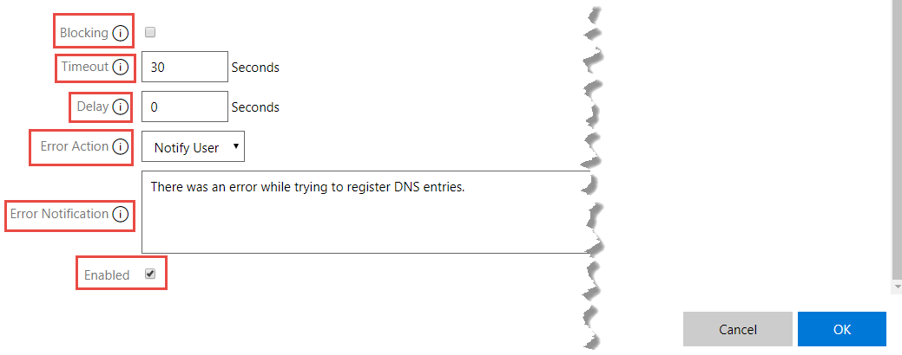
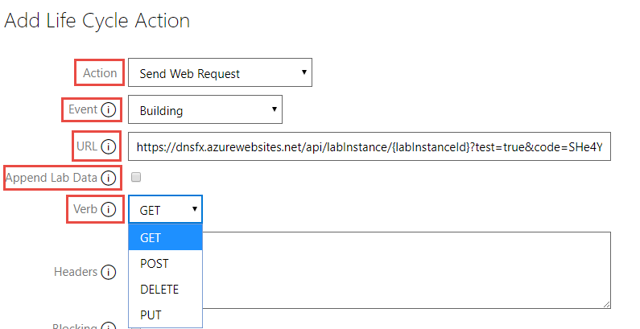
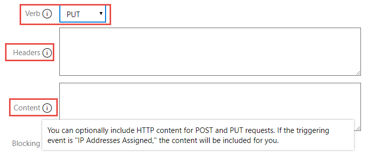
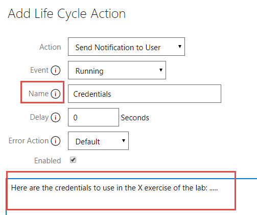
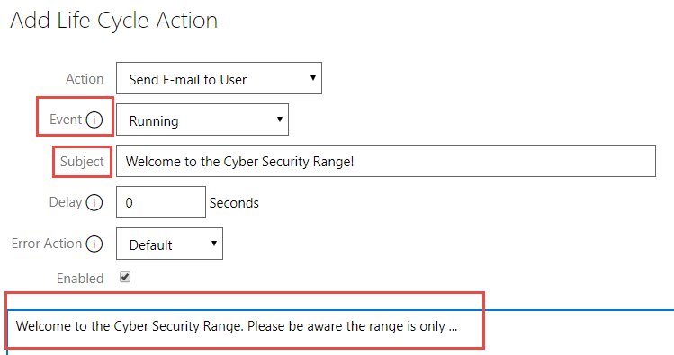
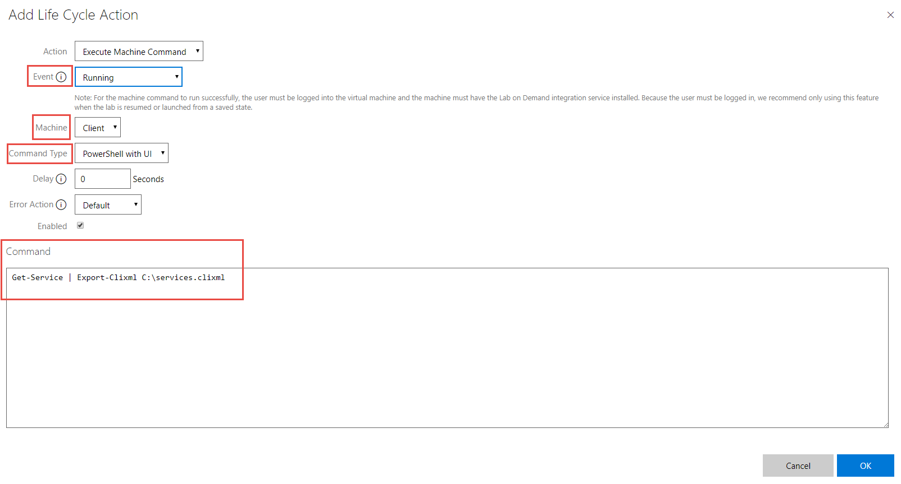
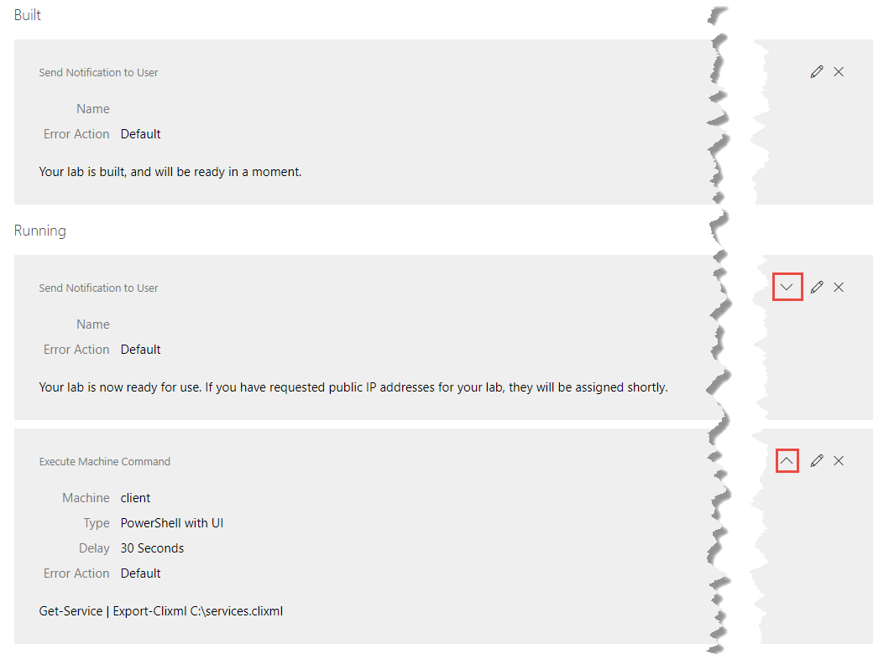

# Learn on Demand Systems Life Cycle Actions Guide

## Revision History

| Version | Date            | Edited By       | Comments                |
| ------- | --------------- | --------------- | ----------------------- |
| 1       | August 14, 2017 | Stephanie Clark | Unreleased; first draft |

## Disclaimer

This document supports a release of a software product that may be changed substantially in the future. It is provided for informational purposes only and Learn on Demand Systems, LLC, makes no warranties, either express or implied, in this document. Information in this document, including URL and other Internet Web site references, is subject to change without notice. The entire risk of the use or the results from the use of this document remains with the user. Unless otherwise noted, the companies, organizations, products, domain names, e-mail addresses, logos, people, places, and events depicted in examples herein are fictitious. No association with any real company, organization, product, domain name, e-mail address, logo, person, place, or event is intended or should be inferred. Complying with all applicable copyright laws is the responsibility of the user. Without limiting the rights under copyright, no part of this document may be reproduced, stored in or introduced into a retrieval system, or transmitted in any form or by any means (electronic, mechanical, photocopying, recording, or otherwise), or for any purpose, without the express written permission of Microsoft Corporation.

Learn on Demand Systems, LLC may have patents, patent applications, trademarks, copyrights, or other intellectual property rights covering subject matter in this document. Except as expressly provided in any written license agreement from Learn on Demand Systems, the furnishing of this document does not give you any license to these patents, trademarks, copyrights, or other intellectual property.

Copyright 2017 © Learn on Demand Systems, LLC. All rights reserved.

All other trademarks are property of their respective owners.

# Introduction

This guide provides information on building Life Cycle Actions in labs in Lab on Demand.

## Intended Audience

This guide assumes that the reader:

- Has a developer account with sufficient permissions to create a lab and modify select properties of a Lab Profile.
- Has existing labs hosted by LODS.
- Has a help desk support contract to pay for additional custom contract work.

The guide further assumes that the reader has knowledge of how to build labs in LOD and knowledge of life cycle events of LOD labs..

In the past, you could send a request to an outside URL whena lab was first built or torn down using the Build Service URL and Tear DownService URL fields on the Advanced tab of the Lab Profile. This functionalityhas been expanded to include more actions and a wider range of life cycleevents of the lab. These are called Life Cycle Actions. The types of actionsthat can be performed are:

·        **Send WebRequest** – Like the Service URLs in the past, calls an external service URL.The information that is sent is based on that URL, the verb used to send theinformation, and the receiving API.

·         **Send Notification to User **– Uses theSend Notification functionality to send information to the lab user in the formof a toast in the lab interface.

·        **SendE-mail to User** – Sends an e-mail to the lab user. The subject and contentof the e-mail will be the same for each lab user.

·        **ExecuteMachine Command** – Like the Command field on lab steps. It requires the labuser to be logged into a virtual machine that has the Lab on Demand integrationservice installed. It runs a machine command on the active machine.

Each of these actions have different events and fieldsrelated to them. Currently there are 10 overall events:

1.   **Building**– when the lab user launches the labs and the environment is in the process ofbeing built, including the virtual machines (VMs) if present.

2.   **Built**– after the lab environment has been built but the virtual machines are stillpowering up.

3.   **Running**– Once the lab user can interact with the lab interface and the VMs, ifpresent.

4.   **IP AddressAssigned** – When the public IP address has been assigned, when applicable.

5.   **Saving**– When the lab user clicks Save and confirms they want to save the lab.

6.   **Saved**– After the lab has finished the Save process.

7.   **Resuming**– When the lab user clicks Resume and the lab interface is in the process ofrebuilding itself

8.   **Resumed**– When the lab user is again able to interact with the lab interface and theVMs, if present.

9.   **TearingDown** – When the lab user cancels or completes the lab and the labenvironment is being torn down.

10.   **Torn Down** – Once the tearing downprocess has been completed.

# Add Life Cycle Actions

To add Life Cycle Action to your lab profile, follow these steps for every Action:

1. Scroll down on the **Advanced** tab, and in the new **Life Cycle Actions** section, click **Add Life Cycle Action**.
2. From the **Action Type** dropdown, select the action you want performed.
3. From the **Event** dropdown, select the event when you want the web request to be sent.
4. In the **Delay** box, set the number of seconds after the Life Cycle Event occurs that the Action should trigger, if wanted.
5. In the **Error Action** dropdown, select the type of action to LOD will take if an error occurs.
   1. If you select **Notify User** as the **Error Action**, an **Error Notification** field will appear. Type the text the user will receive in the Notifications toast in the lab interface.
6. Uncheck **Enabled** if necessary.
7. Click **OK** to add the **Life Cycle Action**.

                                  

Below are the steps specific to each Action type.

## Send Web Request

1. In the **URL** field, type the URL of the external service you want called. Include any placeholders for live data, as needed.
2. Check **Append Lab Data** if needed. When checked, the following data is appended to the URL as parameters in name=value format:
   1. labProfileId
   2. labInstanceId
   3. userId
   4. userExternalId (if launched via API)
   5. username
   6. email
   7. firstName
   8. lastName
   9. tag (if included when launched via API)
3. In the **Verb** dropdown, select the HTTP verb that will be used to send the request.

4. In the **Headers** box, add optional HTTP headers. Each should be on a separate line and in the format of name=value.
   1. If the **POST** or **PUT** verb is chosen in the **Verb** dropdown, add optional HTTP content in the **Content** field that will appear. 

     

5.   Check **Blocking** if you want the lab to be paused while awaiting a response from the external web service.

6.   In the **Timeout **field, set the number of seconds the lab should wait for the external service to reply before giving up.

## Send Notification to User

1.    In the **Name** field, optionally type the name for the notification. If a name is provided, only one copy of the notification with that name will be displayed in the lab client. This allows you to replace a notification with updated text.

2.    In the empty field under **Enabled**, type the notification text.

     

## Send E-mail to User

1.    In the **Subject** field, type the subject for the email. 

2.    In the empty field under **Enabled**, type the body of the email.

     

## Execute Machine Command

The Execute Machine Command action can only be triggered by the Running, IP Addresses Assigned, and Resumed events. For the command to run successfully, the user must be logged into the virtual machine and the machine must have the Lab on Demand integration service installed. Because the user must be logged in, we recommend only using this feature when the lab is resumed or launched from a saved state.

1.   From the **Machine **dropdown, select the VM on which you want the command to run.
2.   From the **Command Type** dropdown, select the type of command:
     1.   PowerShell
     2.   PowerShell with UI
     3.   Shell
     4.   Shell with UI

3.           In the **Command** field under **Enabled**, type the command to run.

     

# Manage Life Cycle Actions

Once you have added Life Cycle Actions to your lab, they will be listed with their details by the Event that triggers them under Life Cycle Actions in the Lab Profile. If there is more than one Action per trigger Event, they can be arranged in the order they should occur when the Event happens. To do this, click the **Up** or **Down** arrow on the right side of the Action you want to move. You can only move Actions within a trigger Event.

      

You can **Edit** and **Delete** an Action from the buttons on the right side of it as well.